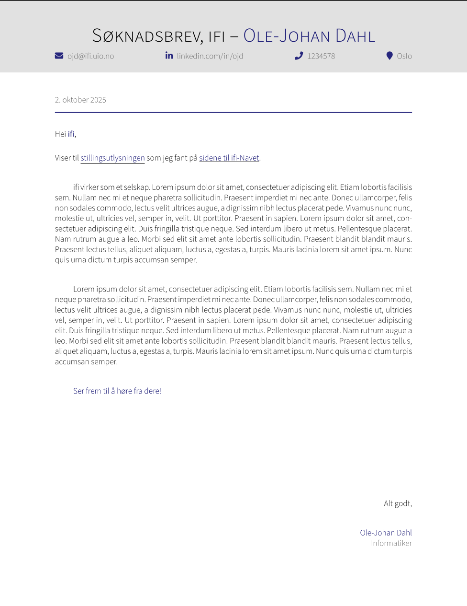

# Cover letter template

A LaTeX cover letter template intended to complement the
[YAAC CV template](https://github.com/darwiin/yaac-another-awesome-cv).

Adapted from "[Simple Cover
Letter](https://www.overleaf.com/latex/templates/simple-cover-letter/jmkbrdnmxmbn)"
of Sid Lacy.

## Usage

Simply edit the relevant metadata fields in [info.tex](./info.tex), and write
your desired text in the [body](./body.tex)

Compile using `lualatex`, `$ lualatex main.tex`.

### International usage

The template is somewhat Norwegian-coded. You will have to make certain trivial
modifications to the [base code](./main.tex) in order for this to work well for
other languages. Feel free to create an issue if you have any questions
regarding this.

## Preview

## Contributions

Very welcome.
